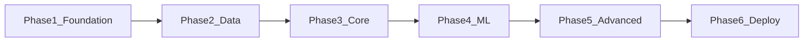

# Prism Catalyst – Development Plan

Single source of truth for build order, milestones, and phase dependencies. For full scope, tech stack, and feature list see [README.md](../README.md).

---

## Phase Overview

| Phase | Timeframe | Focus |
|-------|-----------|--------|
| 1 – Foundation | Weeks 1–3 | Repo structure, DB schemas, API + auth, React skeleton, CI/CD |
| 2 – Data Infrastructure | Weeks 4–6 | Market data APIs, ingestion pipeline, Redis, historical storage |
| 3 – Core Features | Weeks 7–10 | WebSocket streaming, charting, portfolios, dashboard |
| 4 – Machine Learning | Weeks 11–14 | Sentiment, price prediction, backtesting, ML API + frontend |
| 5 – Advanced Analytics | Weeks 15–17 | Optimization, risk metrics, pattern search, advanced viz |
| 6 – Polish & Deploy | Weeks 18–20 | Performance, testing, AWS, production, monitoring |

---

## Phase 1: Foundation (Weeks 1–3)

**Objectives**
- Establish repo layout and tooling so backend, frontend, and infra can evolve in parallel.
- Deliver a minimal but deployable slice: auth, one API, one frontend route, CI that builds both.
- Define data models for users and portfolios so later phases can integrate cleanly.

**Dependencies:** None (starting phase).

### Tasks and deliverables

- [x] **Set up repository structure**  
  Create folders per README: `backend/` (api-service, websocket-service, data-pipeline), `frontend/` (src with components, pages, hooks, services, utils), `ml-models/` (sentiment, prediction, optimization), `infrastructure/` (terraform, docker), `scripts/` (data-collection, deployment), `docs/` (api, architecture, guides), `tests/` (unit, integration, e2e). Add root `.gitignore`, `.env.example` placeholders where needed.

- [x] **Design database schemas**  
  PostgreSQL: users (id, email, password_hash, created_at, etc.), portfolios (id, user_id, name, created_at), transactions/holdings as needed for Phase 3. Document in `docs/architecture/` or migration comments. Optional: high-level MongoDB doc model for future news/sentiment (e.g. collection names, key fields).

- [x] **Implement basic REST API**  
  Express + TypeScript under `backend/api-service/`. Versioned base path `/api/v1`. Endpoints: `GET /api/v1/health`, `POST /api/v1/auth/register`, `POST /api/v1/auth/login` returning JWT. Use parameterized queries and a shared logger. No raw SQL string concatenation.

- [x] **Create React frontend skeleton**  
  React 18+ with TypeScript (Vite or Create React App). Routing in place; at least one placeholder dashboard page (e.g. `/` or `/dashboard`). API client module under `frontend/src/services/` that can call the health and auth endpoints. State management (Redux Toolkit or Zustand) scaffold only if needed for auth state.

- [x] **Set up CI/CD pipeline**  
  GitHub Actions (or GitLab CI): install deps, lint, run tests, build for `backend/api-service` and `frontend`. No deploy step required for Phase 1; pipeline must succeed on push/PR.

- [x] **Docker Compose for local dependencies**  
  `docker-compose up` brings up PostgreSQL (and optionally Redis/MongoDB) so API and future services can run locally. Document in README or `docs/guides/` how to run API + frontend against these.

### Acceptance criteria (Phase 1)

- `docker-compose up` starts required DBs without errors.
- API serves `GET /api/v1/health` and at least one protected route that requires a valid JWT (e.g. `GET /api/v1/me` or similar).
- Frontend builds and displays a dashboard route; can call health (and optionally login) via the API client.
- CI runs lint + test + build for both API and frontend and passes.

---

## Phase 2: Data Infrastructure (Weeks 4–6)

**Objectives:** Ingest market data from an external API, cache it in Redis, persist history in a time-series–friendly store, and validate data quality.

**Key deliverables**
- [x] Integration with at least one market data API (e.g. Alpha Vantage, Yahoo Finance, IEX Cloud).
- [x] Data ingestion pipeline (Python in `backend/data-pipeline/` or separate service); optionally Kafka/Redis Streams for events.
- [x] Redis caching layer for real-time quotes and session-related data.
- [x] Historical data storage (e.g. PostgreSQL tables with time bucketing or dedicated time-series DB).
- [ ] Data quality checks (e.g. schema validation, null/range checks, basic monitoring).

**Dependencies:** Phase 1 (API and repo structure; DB available).

---

## Phase 3: Core Features (Weeks 7–10)

**Objectives:** Real-time data on the UI, interactive charting, portfolio CRUD, and a user dashboard with watchlists.

**Key deliverables**
- [ ] WebSocket service and client for real-time market data (e.g. quotes, trades).
- [ ] Interactive charting (D3.js or Lightweight-charts) – at least candlestick or OHLC + volume.
- [ ] Portfolio creation and tracking (create, read, update; link to users and positions).
- [ ] Basic technical indicators (e.g. RSI, MACD, or Bollinger Bands) available via API or frontend calc.
- [ ] User dashboard and watchlists (list symbols, add/remove, persist per user).

**Dependencies:** Phase 2 (data pipeline, Redis, historical storage).

---

## Phase 4: Machine Learning (Weeks 11–14)

**Objectives:** Ship at least one ML capability end-to-end (e.g. sentiment or price prediction), plus a backtesting framework for strategies.

**Key deliverables**
- [ ] Sentiment analysis on financial text (e.g. FinBERT or similar) – training or fine-tuning and inference API.
- [ ] Price prediction models (e.g. LSTM/GRU); expose as inference endpoint(s).
- [ ] Backtesting framework for algorithmic strategies (historical data + strategy runner + metrics).
- [ ] ML inference API (FastAPI or Express-proxy) callable from frontend.
- [ ] Frontend integration: at least one ML-driven view (e.g. sentiment dashboard or prediction chart).

**Dependencies:** Phase 3 (real-time data, portfolios, dashboard).

---

## Phase 5: Advanced Analytics (Weeks 15–17)

**Objectives:** Portfolio optimization, risk metrics, pattern/similarity search, and advanced visualizations.

**Key deliverables**
- [ ] Portfolio optimization (e.g. mean–variance with scikit-learn); API + optional UI.
- [ ] Risk analytics (VaR, Sharpe, beta, drawdown) – API and dashboard widgets.
- [ ] Pattern recognition or similarity search (e.g. FAISS) for similar market regimes.
- [ ] Advanced visualization dashboards (correlation heatmaps, multi-asset views).
- [ ] Optional: Tableau/Power BI integration or export for reports.

**Dependencies:** Phase 4 (ML endpoints, backtesting, frontend integration).

---

## Phase 6: Polish & Deploy (Weeks 18–20)

**Objectives:** Harden performance, test coverage, and production deployment with monitoring.

**Key deliverables**
- [ ] Performance tuning (API p95 &lt; 100ms, WebSocket &lt; 50ms, chart render &lt; 500ms for 1k+ points where applicable).
- [ ] Comprehensive testing: unit (backend + frontend + Python), integration (API + DB), E2E (critical user flows).
- [ ] AWS (or chosen cloud) setup with Terraform: e.g. ECS/EC2, RDS, ElastiCache, S3.
- [ ] Production deployment and runbooks.
- [ ] Monitoring and alerting (CloudWatch, Prometheus/Grafana, or equivalent).
- [ ] Documentation: API docs (Swagger/OpenAPI), architecture overview, setup and runbooks.

**Dependencies:** Phase 5 (all core and advanced features in place).

---

## Milestones and success checks

| Milestone | After phase | Success check |
|-----------|-------------|----------------|
| **M1** | Phase 1 | Auth works; CI builds and runs tests for API and frontend. |
| **M2** | Phase 2 | Market data flows from external API into storage/cache; pipeline runs without manual DB seeding for quotes. |
| **M3** | Phase 3 | Live quotes on UI; at least one portfolio view; at least one interactive chart. |
| **M4** | Phase 4 | At least one ML endpoint (sentiment or price prediction) callable from frontend and displayed in UI. |
| **M5** | Phase 5 | Risk/optimization or advanced viz (e.g. correlation matrix, optimization result) available in app. |
| **M6** | Phase 6 | Production deploy live; monitoring and alerting on; API and architecture docs complete. |

---

## Risks and mitigations

| Risk | Mitigation |
|------|------------|
| Data provider rate limits or downtime | Cache aggressively in Redis; consider a second provider as fallback; design pipeline to tolerate gaps. |
| ML model latency above target (&lt; 200ms) | Optimize inference (smaller model, batching, GPU if needed); cache frequent predictions. |
| Scope creep | Stick to optional items (mobile, Tableau/Power BI, OCaml/C++) as post–v1; track “out of scope” below. |

---

## Out of scope for v1

- Native mobile app (iOS/Android).
- Tableau / Power BI deep integration (beyond export or simple webhooks if added later).
- OCaml/C++ high-frequency calculation engines.
- Full GraphQL API (REST first; GraphQL optional per README).
- **AI agents** (research/assistant with LLM + tools over market data, sentiment, portfolio) – planned for a future phase.

---

## References

- [README.md](../README.md) – Vision, stack, prerequisites, local setup.
- [.cursor/rules](../.cursor/rules) – Coding standards for TypeScript backend, React frontend, Python/ML.
- `docs/architecture/` – Future system design and data-flow docs.
- `docs/api/` – API documentation (Swagger/OpenAPI when available).
